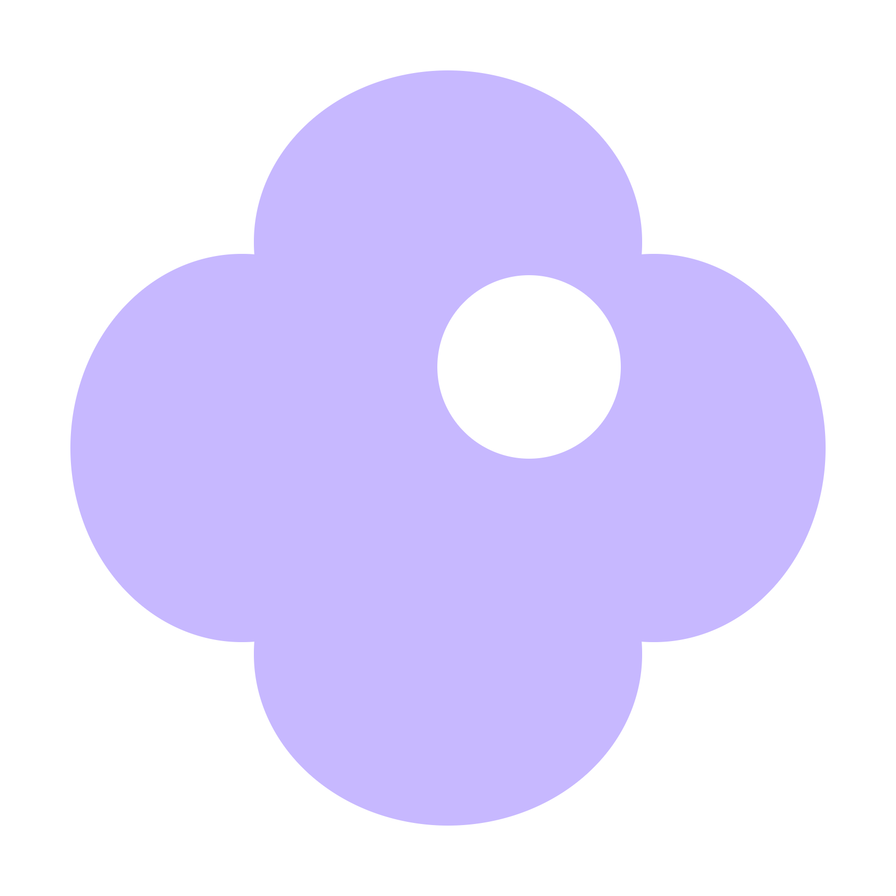
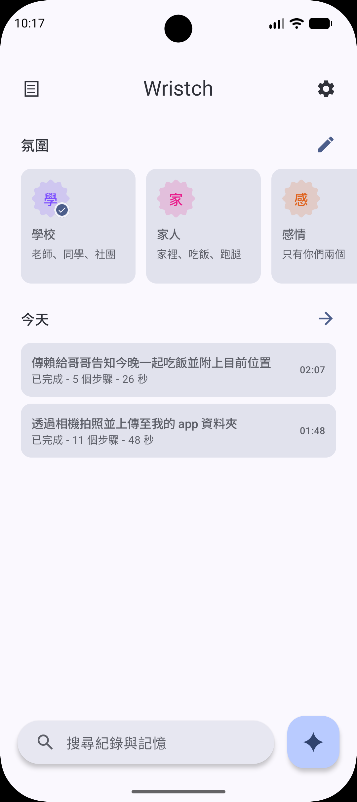
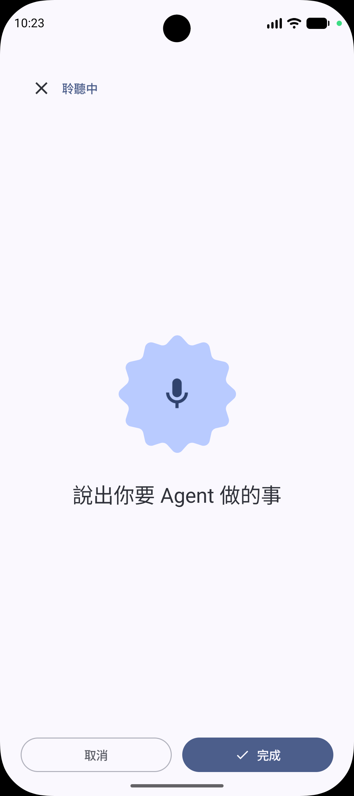
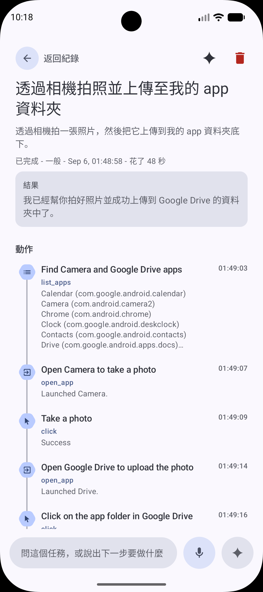
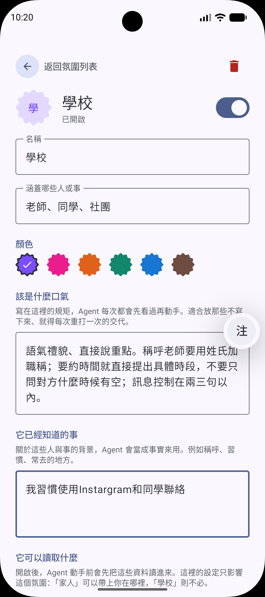

# Wristch

  

> Built at the 2026 FUTUREMODE × SITCON Hackathon with ANYI

Android 上的通用 Agent：一句話說出需求，即可在手機上自動點擊、滑動與輸入，在你分身乏術時幫你搞定大小事。

**舉例：**

- 「傳訊息給老師說我明天想討論報告」→ 開啟通訊軟體、找到對象、依 Vibe 設定的語氣撰寫並送出
- 「叫哥哥來這裡吃飯」→ 自動帶入目前所在餐廳的資訊與 Google Maps 連結

| 首頁                                                    | 語音輸入                                                               | 任務紀錄                                                           | Vibe 設定                                                             |
| ------------------------------------------------------- | ---------------------------------------------------------------------- | ------------------------------------------------------------------ | --------------------------------------------------------------------- |
|  |  |  |  |

## 環境

- Android 15+（`minSdk 35`，`targetSdk 37`）
- Kotlin / AGP 2.4.10 / 9.3.2

## 建置

```bash
echo 'geminiApiKey=你的Gemini_Secret' >> local.properties

./gradlew installDebug
```

安裝後需要到 **設定 → 協助工具 → Wristch** 手動開啟無障礙服務；未開啟時 App 會擋在 `AccessibilityBlockerScreen`，無法開始任務。

---

## 架構總覽

```
使用者輸入（語音／文字）
        │
        ▼
  ┌───────────────┐   Vibe.prompt() + VibeContext.gather()
  │  AgentSession │ ◄─────────────────────────────────────── 情境來源（位置／行事曆／訊息／聯絡人／記憶）
  └───────┬───────┘   process 層級，不綁任何 Composable 生命週期
          ▼
  ┌───────────────────────────────────────────────┐
  │            ComputerUseAgent.run()             │
  │                                               │
  │  triage ──┬── 不需要裝置 → 直接回答（+Search）│
  │           └── 需要裝置 → drive() 迴圈：       │
  │                                               │
  │    capture() ──► Gemini（截圖 + UI Tree）     │
  │        ▲                     │                │
  │        │              functionCalls           │
  │        │                     ▼                │
  │        │        needsApproval? ─► 懸浮確認    │
  │        │                     ▼                │
  │        └──────── ActionDispatcher.execute()   │
  │                     （最多 50 步）            │
  └───────────────────────────────────────────────┘
          │
          ▼
  RunHistory（逐步紀錄）＋ MemoryStore（萃取長期事實）
```

### 無障礙服務層（`accessibility/`）

`WristchAccessibilityService` 是整個 Agent 的手與眼，設定見 [`res/xml`](app/src/main/res/xml)：

- `canTakeScreenshot` —— 用 `AccessibilityService.takeScreenshot()` 截圖，**不需要 MediaProjection 的每次授權對話框**，這是無人值守連續截圖能成立的關鍵。
- `canPerformGestures` —— 以 `dispatchGesture()` 送出真實觸控手勢。
- 不設 `packageNames` 過濾：刻意 app-agnostic。
- `flagIncludeNotImportantViews` —— 很多 App 把容器標成 not-important，但畫面上唯一的文字就在那裡面。

`ScreenExecutor` 負責實際互動，兩個實作上的重點：

- **自己寫 DFS 而不用 `findAccessibilityNodeInfosByText`**：Compose 把整個畫面畫在單一 `AndroidComposeView` 上，semantics 是**虛擬節點**，內建搜尋在 Compose UI 上實測回傳 0 個節點。
- **輸入框用「先點再寫」**：`focusAt()` 送出點擊後等待 focus 交接，再對 `findFocus(FOCUS_INPUT)` 拿到的節點 `setText()`。這條路徑不需要 id、文字或 content description，對完全沒有無障礙標註的 App 也有效。

### 螢幕表示法：截圖 + UI Tree 雙軌（`accessibility/UiTree.kt`）

只給截圖，模型必須從像素裡「讀」標籤，而每一次讀錯都要付一整個 round trip。所以每一步同時送出：

- **JPEG 截圖**：最長邊縮到 768px、quality 80——版面資訊靠它。
- **UI Tree 文字**：每個可操作節點一行 `(x,y) Role "label" [flags]`，最多 60 行。標籤直接來自 accessibility node，精確且只有幾 KB。

座標直接輸出在**與模型作答相同的 0–999 正規化網格**上，從樹上讀到的中心點可以原封不動當成 click 座標送回去，中間不需要任何換算。

### Agent 迴圈（`computer/ComputerUseAgent.kt`）

| 機制                                | 做法與理由                                                                                                                                                                                                              |
| ----------------------------------- | ----------------------------------------------------------------------------------------------------------------------------------------------------------------------------------------------------------------------- |
| **開場先回首頁**                    | 任務是從 Wristch 內啟動的，不先 `pressHome()`，模型看到的第一個畫面就是我們自己的 UI，然後它會開始點我們的分頁、試圖在這個 App 裡完成任務。                                                                             |
| **Triage 併行**                     | 「明天會不會下雨」不需要動手機。Triage 用 structured output（`needs_device: Boolean`）判斷，並**與回首頁併行執行**，4 秒預算內沒答完就直接走裝置路徑——不替已經要付的 round trip 再加時間。                              |
| **structured output 而非 sentinel** | 早期讓模型回字串 `NEEDS_DEVICE`，遇到「This needs the device, so NEEDS_DEVICE」會判反。boolean 沒有語氣可言。                                                                                                           |
| **`ask_user` 做成 tool**            | 需要追問時，若只叫模型「用某個前綴回覆」，一個手上有工具的模型會做它本來就會做的事——亂點一個然後祈禱。把「問人」變成一個可呼叫的 function，才真的擋得住猜測。                                                           |
| **截圖裁剪**                        | 每次請求都會重送整段對話，第 2 步的截圖會在之後每一步被重複計費。只保留最近 4 張影像，更早的換成 `[earlier screenshot omitted]`，但**函式回應裡的 UI Tree 文字保留**——影像被丟掉後，那行文字就是歷史對該步的全部記憶。  |
| **捲到底判定**                      | 只比對 UI Tree 而不比對 JPEG：同一個靜止畫面的兩張 JPEG 幾乎不會 byte 相同（動畫、抗鋸齒），但元素列表會。捲動後樹沒變 → 明確告訴模型已到底，避免無限捲動或只看一頁就放棄。                                             |
| **執行中插話**                      | 使用者中途補充的話進 `ConcurrentLinkedQueue`，由 run 自己的 coroutine 在下一輪 drain，**不從別的執行緒直接插進 history**——那是對話順序錯亂的來源。補充內容以獨立 user turn 送出，並註明「比上面都新，衝突時以它為準」。 |
| **暫停時機**                        | `awaitGo()` 擋在**送出請求之前**，而不是回來之後：問模型要花錢也花時間。同一則回覆可能含多個動作，所以 gate 放在動作迴圈內部。                                                                                          |

### 確認機制（`ConfirmationOverlay` / `VibeConfirmation`）

Agent 執行時 Wristch 根本不在前景，App 內的 Dialog 永遠不會被看到。因此確認 UI 用 `TYPE_ACCESSIBILITY_OVERLAY` 畫在所有 App 之上——相較 `TYPE_APPLICATION_OVERLAY`，它由無障礙服務身分直接取得，**不需要 SYSTEM_ALERT_WINDOW，也不必讓使用者跑一趟設定頁**。

三段式確認層級的判定刻意不全交給模型：

- `ALWAYS` / `NEVER` 由**本地程式**決定，不看模型的 `safety_decision`——設成每次都問的 Vibe，不該取決於 Gemini 是否同意這一步算危險；設成全自動的，也不該被模型推翻。
- 只有 `RISKY_ONLY` 才讀模型的 `safety_decision.decision`，因為那正是需要判斷力的那一種情況。
- `safety_decision` 以**字串比對**而非型別轉換讀取：如果它換成別的 node 型別而被靜默讀成「不需確認」，等於閘門失效卻不留痕跡。

### Vibe 與情境注入（`vibe/`、`context/`）

Vibe 把「語氣規則」「背景事實」「可讀取的情境來源」「確認層級」綁在同一個情境上，而非全域設定。

- `instruction` 在 prompt 裡標成 _standing instructions, follow as if part of the task itself_——實測中它常被當成參考語氣，被當下匆忙輸入的一句話蓋掉，但 Vibe 是寫一次用好幾個月的東西。
- `instruction` 與 `notes` 拆成兩欄：編輯語氣時不必先捲過一整段人物資料。
- `VibeContext.gather()` **併發**讀取所有已授權來源，每個來源 12 秒超時，任何一個失敗、未授權或回空都只是從段落中消失，不會中斷任務。
- 權限逐 Vibe 索取（`VibeSourceAccess`）。位置同時接受粗略定位——Vibe 要的是「這是哪家餐廳」，不是精準座標。

### 狀態、紀錄與記憶

- `AgentSession` 是 process 層級的 object。任務會操作實體手機好幾分鐘，而使用者本來就該把手機放著走人——若綁在 Agent 畫面的 composition scope，返回上一頁就會取消掉正在看的那個任務。同時只允許一個任務：兩個 Agent 搶同一支手機不會有任何一個做完。
- `RunHistory` / `MemoryStore` 每次變更就寫檔（無 debounce）：任務中途被系統殺掉時，仍會留下一筆「停在第幾步」的紀錄——而這確實發生過。上限分別為 100 筆與 200 則，舊的自然淘汰。
- 任務結束後另一次無工具、無截圖的呼叫從 transcript 萃取記憶，回傳 **list 而非單一字串**：一個任務可能教會兩件不相關的事，硬要模型寫成一句話只會黏在一起讓使用者自己拆。允許空——多數任務不值得留下任何東西。

### 語音輸入（`voice/`）

Android 內建辨識取得初稿 → Gemini 修文法、去口語贅詞 → 自動送出。改寫失敗時 fallback 回原文：連不上網不該讓已經聽懂的話整句消失。語音與 Agent 共用同一組 Gemini 金鑰——第二把金鑰只會多一個要設定的地方。

---

## 關於 WearOS

專案初期做過一個 WearOS 手勢辨識原型（TensorFlow Lite 讀 100Hz 六軸 IMU，架構參考 Apple 的論文 [_Enabling Hand Gesture Customization on Wrist-Worn Devices_](https://arxiv.org/abs/2203.15239)），想用握拳、捏指等手勢直接觸發手機端不同 Vibe 的 Agent，但最後因時間不足，沒能和手機 App 完整串接，因此本專案的重心與完成度都在手機 App 上。

## 專案結構

```
.
├── app/              # 主要程式碼
│   └── src/main/java/dev/eliaschen/wristch/
│       ├── accessibility/  # 無障礙服務、螢幕操作、UI Tree 序列化
│       ├── chat/           # 任務對話
│       ├── computer/       # Agent 迴圈、動作分派、懸浮視窗、結構化輸出 schema
│       ├── context/        # 情境來源（位置／行事曆／訊息／聯絡人／記憶）
│       ├── history/        # 執行紀錄
│       ├── memory/         # 長期記憶
│       ├── settings/       # 全域設定
│       ├── ui/             # Compose UI
│       ├── vibe/           # Vibe 模型與儲存
│       └── voice/          # 錄音、辨識、改寫、朗讀
└── gradle/           # 依賴管理
```

## 權限

`INTERNET`、`RECORD_AUDIO`，以及由 Vibe 情境來源按需索取的 `ACCESS_FINE_LOCATION` / `ACCESS_COARSE_LOCATION`、`READ_CALENDAR`、`READ_CONTACTS`、`READ_SMS`。無障礙服務需使用者手動開啟。

## 已知限制

- 為了控制API用量，單一任務上限 50 步，超過即停止並回報。
- 同時只能執行一個任務。
- 每步都要一次模型往返，速度受限於網路與模型延遲。
- Computer Use 依賴畫面理解，遇到動畫中或非標準繪製的 UI 仍可能點錯。

## 授權

[MIT License](LICENSE)

---

_讓科技回歸它該有的樣子：幫你做事，而不是佔用你的時間。_
